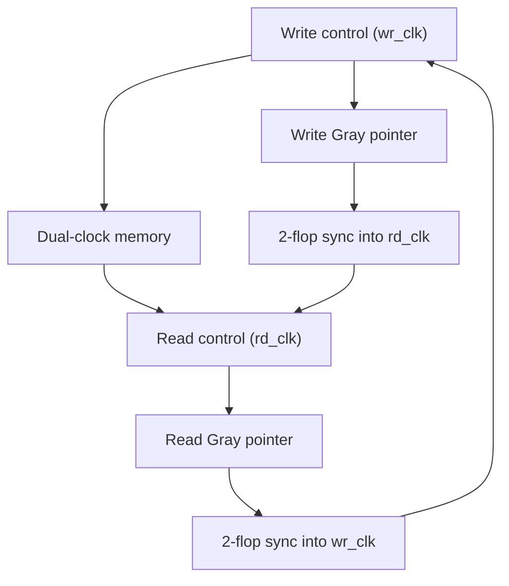

<div align="center">
  <h1>Asynchronous FIFO with Gray-Code Pointers</h1>
  <p><strong>Dual-clock SystemVerilog FIFO with CDC-safe pointer transfer and domain-local reset release</strong></p>
  <p>
    
    
    
    
  </p>
</div>

## Overview

This repository implements a parameterized asynchronous FIFO for transferring data between unrelated write and read clock domains. Binary pointers address the storage array locally; Gray-coded pointers cross the clock-domain boundary through two-stage synchronizers and are compared to generate domain-local `full` and `empty` status.

The RTL follows an asynchronous-assert, synchronous-release reset strategy and keeps the memory array unreset to support practical memory inference.

## Design status

| Item | Status |
|---|---|
| Modular synthesizable RTL | Implemented |
| Dual-clock data storage | Implemented |
| Gray-pointer CDC | Implemented |
| Two-flop reset release per domain | Implemented |
| Functional specification | Included as DOCX |
| Executable testbench | Not included |
| CDC/lint/synthesis evidence | Not included |

## Default configuration

| Parameter | Default | Description |
|---|---:|---|
| `DATA_WIDTH` | 8 | Width of each stored word |
| `DEPTH` | 16 | Number of words |
| `ADDR_WIDTH` | `$clog2(DEPTH)` | Memory address width |
| `PTR_WIDTH` | `ADDR_WIDTH + 1` | Pointer width including wrap bit |

`DEPTH` must be a power of two and at least 4 for the current full-detection expression and pointer slicing (`ADDR_WIDTH >= 2`).

## Interface

### Write clock domain

| Port | Direction | Width | Description |
|---|---|---:|---|
| `wr_clk` | Input | 1 | Write-domain clock |
| `wr_rst_n` | Input | 1 | Active-low external reset request |
| `wr_en` | Input | 1 | Write request |
| `wr_data` | Input | `DATA_WIDTH` | Write payload |
| `wr_full` | Output | 1 | No write capacity visible in the write domain |
| `overflow` | Output | 1 | Write requested while full |

### Read clock domain

| Port | Direction | Width | Description |
|---|---|---:|---|
| `rd_clk` | Input | 1 | Read-domain clock |
| `rd_rst_n` | Input | 1 | Active-low external reset request |
| `rd_en` | Input | 1 | Read request |
| `rd_data` | Output | `DATA_WIDTH` | Registered read data |
| `rd_valid` | Output | 1 | A read was accepted on the current read edge |
| `rd_empty` | Output | 1 | No readable entry visible in the read domain |
| `underflow` | Output | 1 | Read requested while empty |

## Architecture



| Module | Responsibility |
|---|---|
| `asyn_fifo.sv` | Top-level reset composition and block integration |
| `asyn_fifo_write_ctrl.sv` | Write pointer, full prediction, write acceptance, overflow |
| `asyn_fifo_read_ctrl.sv` | Read pointer, empty prediction, read acceptance, valid, underflow |
| `asyn_fifo_gray_sync.sv` | Two-stage destination-domain Gray-pointer synchronization |
| `asyn_fifo_reset_sync.sv` | Asynchronous assertion and two-clock synchronous release |
| `asyn_fifo_memory.sv` | Dual-clock storage and registered read output |

Only Gray-coded pointers cross between domains. Write payload data moves through the storage array and is sampled only by the read port after the synchronized pointer state indicates that data is available.

## Transaction behavior

```text
wr_accept = wr_reset_done && wr_en && !wr_full
rd_accept = rd_reset_done && rd_en && !rd_empty
rd_valid  = rd_accept registered in rd_clk
```

- At most one word is written per `wr_clk` cycle.
- At most one word is read per `rd_clk` cycle.
- `rd_data` updates only after an accepted read and otherwise holds its previous value.
- `overflow` is high for every write-domain cycle in which `wr_en && wr_full`.
- `underflow` is high for every read-domain cycle in which `rd_en && rd_empty`.
- Full and empty information is conservative because opposite-domain pointer changes require synchronizer latency to become visible.
- `wr_full` and `rd_empty` may both be high temporarily; each flag is valid only in its own clock domain.

The clocks may have any relative frequency or phase and may pause. A paused domain cannot complete reset release or observe new opposite-domain pointer state until its clock resumes.

## Reset behavior

The top level combines the two external reset requests:

```text
fifo_rst_n = wr_rst_n && rd_rst_n
```

Asserting either reset therefore flushes both FIFO domains. Assertion is asynchronous. Release is synchronized independently to `wr_clk` and `rd_clk` through a two-flop pipeline.

After an external reset rises, the first two local rising edges keep local functional state in reset. The first transaction can be accepted on the following local edge. The memory array is not cleared; resetting both pointers makes old contents invalid.

## Compile check

With Icarus Verilog:

```bash
iverilog -g2012 -s asyn_fifo -o asyn_fifo_compile \
  asyn_fifo_reset_sync.sv \
  asyn_fifo_gray_sync.sv \
  asyn_fifo_write_ctrl.sv \
  asyn_fifo_read_ctrl.sv \
  asyn_fifo_memory.sv \
  asyn_fifo.sv
```

## Verification plan

The repository currently has no testbench. A minimum self-checking regression should include:

| Scenario | Main checks |
|---|---|
| Independent reset assertion/release | Both domains flush; no transaction before local reset completion |
| Basic write/read | Data integrity, ordering, and `rd_valid` |
| Fill and drain | Exact full/empty transitions |
| Overflow and underflow | Per-cycle event behavior on illegal requests |
| Pointer wrap | Ordering across multiple complete wraps |
| Clock-ratio sweep | Faster write, faster read, equal frequency, unrelated phase |
| Clock stop/resume | Safe reset and conservative status recovery |
| Simultaneous activity | Independent accepted operations in both domains |
| Random regression | Queue-based reference model with asynchronous clocks |

CDC sign-off should also verify that only Gray-pointer buses cross domains, synchronizer first stages do not feed functional logic, synchronizer registers receive appropriate implementation attributes/constraints, and multi-bit Gray skew is bounded by implementation constraints.

## Known limitations

- No executable verification environment, assertions, functional coverage, or committed waveform evidence is included.
- No technology-specific RAM inference, CDC, lint, synthesis, STA, or PPA report is included.
- The two external reset inputs behave as global FIFO flush requests because they are AND-combined.
- Synchronizer implementation attributes and CDC constraints must be added according to the target ASIC/FPGA flow.
